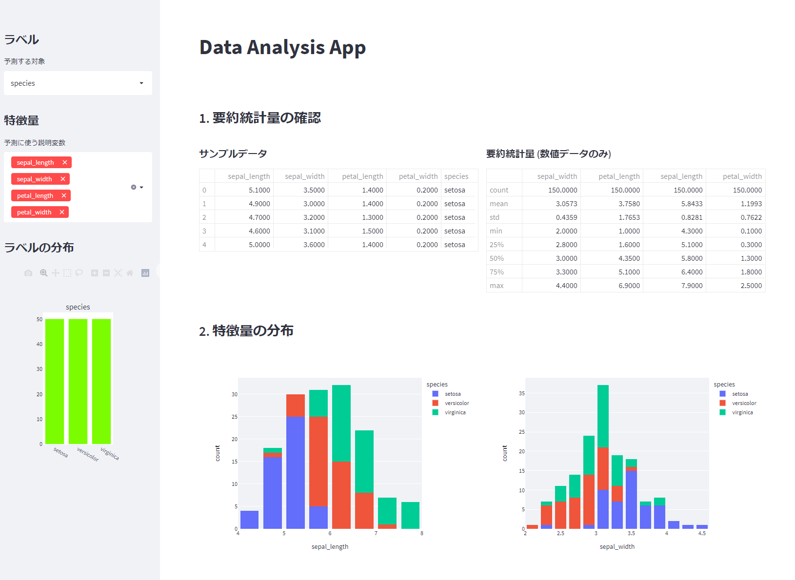

# Data_Analytics_on_Streamlit



## Overview

※諸々、サンプル状態なのでご留意ください。

Pandas形式でデータを渡すことで、Streamlitで選択・グラフ描写を行います。


## Requirement

- streamlit==1.7.0
- seaborn==0.12.2
- japanize-matplotlib==1.1.3

## Usage

* DockerfileをもとにDocker起動

* Docker環境のターミナルで、下記を実施

```
python front/run.py 8062
```

* 画面が開いたら、左のバーで、ラベル（目的変数）と特徴量（説明変数）を選択することで、データの可視化を行う

## Features

* サンプルなので元データは、[Iris flower data set](https://en.wikipedia.org/wiki/Iris_flower_data_set)を利用

* 現状機能としては、ほぼStreamlitのみ


## Future features

* 分析用のデータを自由に選択できるようにする
* バックエンドにDBを持たせる（DuckDB想定）
* scikit-learn等を用いて、予測を実施・分析結果を出力する
* LightGBMでも同様に出して、SHAPとかを出力する

## Author

[Zenn](https://zenn.dev/paxdare_labo)

## Licence